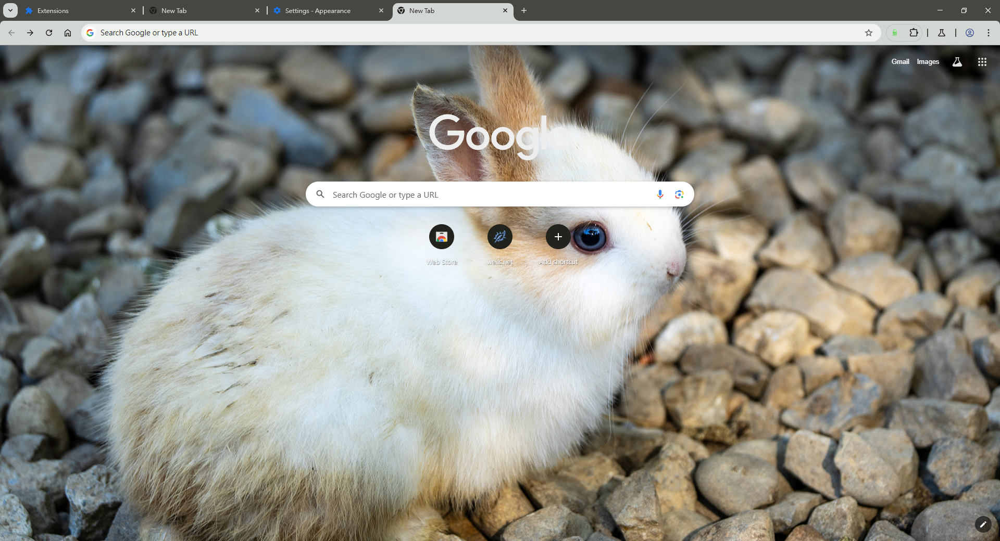
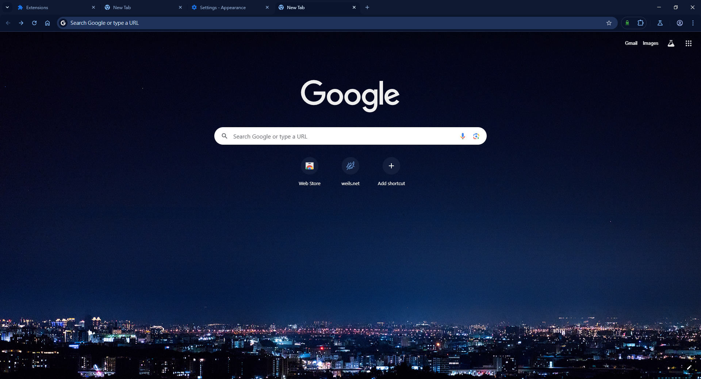
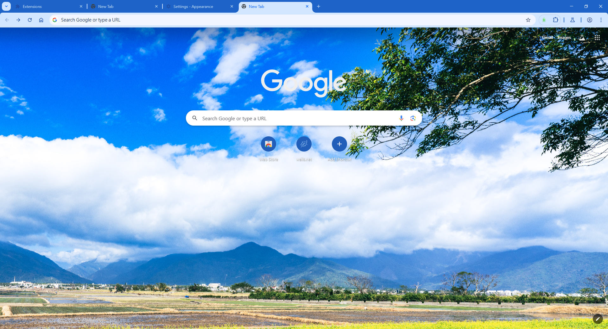
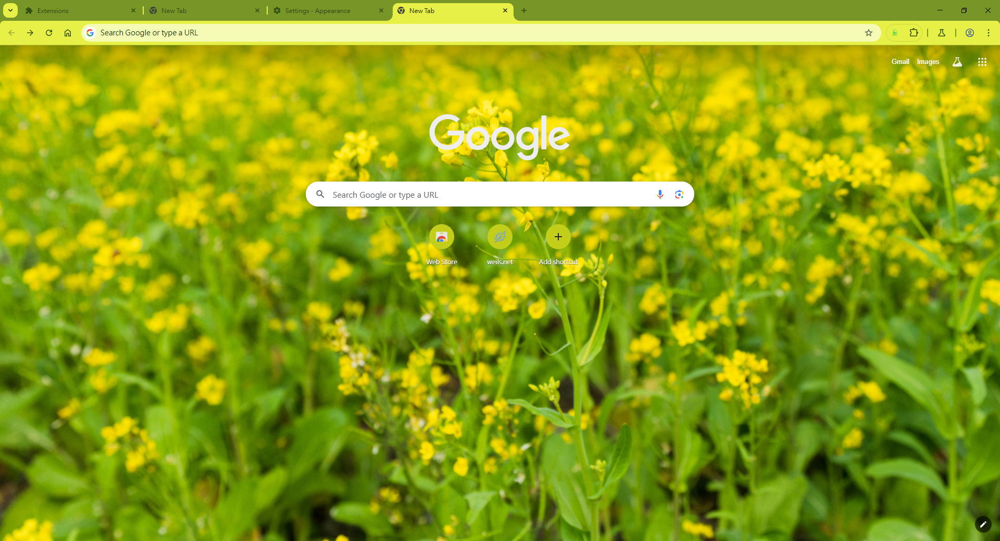
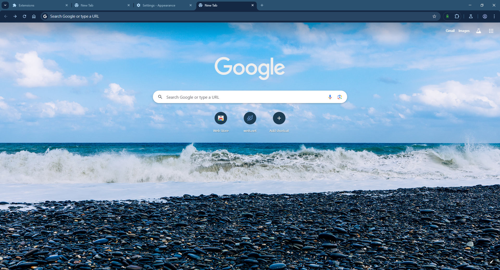
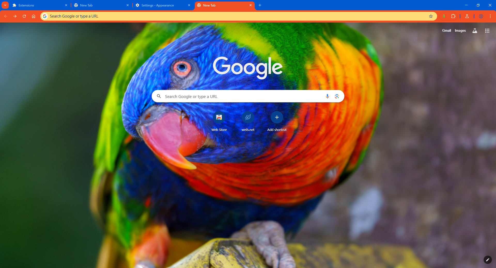
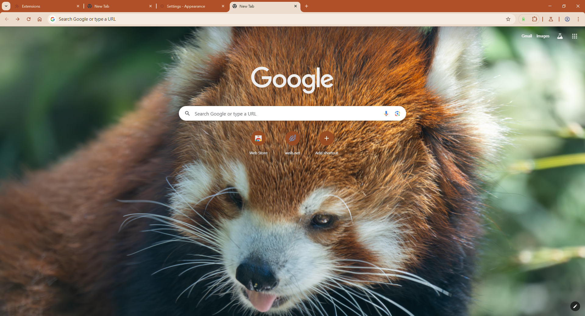
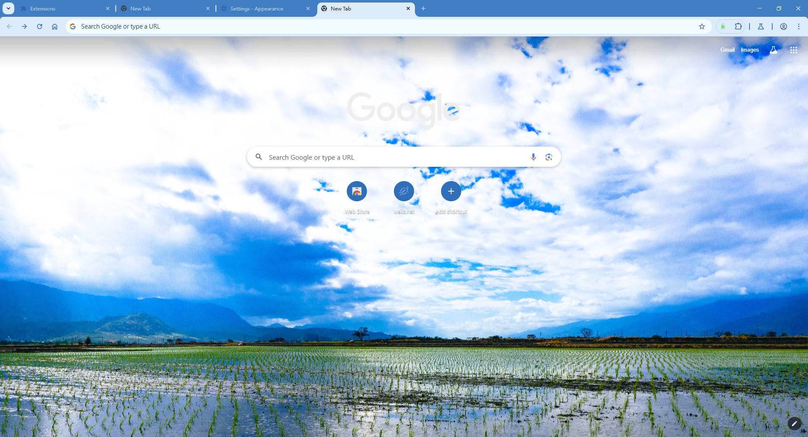
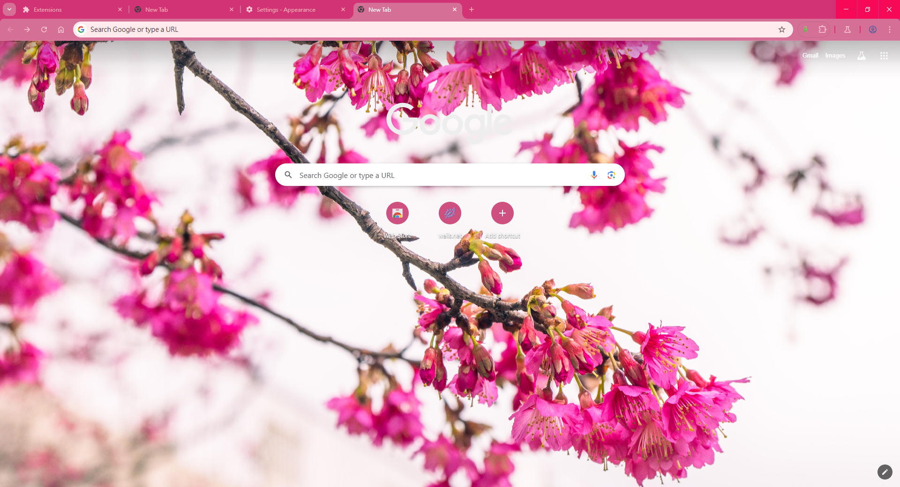
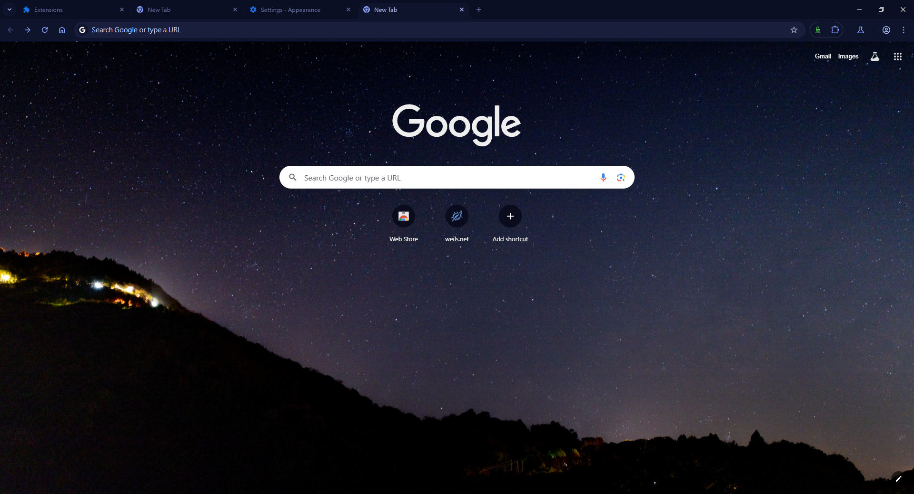

# Browser Theme Collection
A collection of beautiful browser themes featuring various subjects, designed to enhance your browsing experience with visually stunning backgrounds.

# Installation

## Chrome / Chromium-based browsers
[Chrome Web Store Link (soon)]

## Manual installation:
1. Download the desired theme zip file from the collection below
2. Extract the zip file to a local folder
3. Open Chrome and navigate to chrome://extensions/
4. Enable "Developer mode" (toggle in the top-right)
5. Click "Load unpacked" and select the extracted theme folder

## Other browsers
Support for Firefox and other browsers coming soon!

## Available Themes

Each theme is available in Full HD resolution (1920×1080), with select themes also available in 4K resolution (3840×2160).

| Theme | Preview | Description |
|-------|---------|-------------|
| Bunny |  | A charming theme featuring rabbit imagery in beautiful natural settings. |
| Midnight Skyline |  | A sleek Chrome theme inspired by the mesmerizing blue glow of a metropolitan city at night. |
| Mountain Vista |  | A serene Chrome theme capturing the majesty of azure skies, fluffy clouds, distant mountains, and verdant farmlands. |
| Mustard Meadows |  | A vibrant Chrome theme inspired by the sunny yellow mustard flowers blossoming among lush green fields. |
| Ocean Pebbles |  | A serene Chrome theme inspired by the tranquil blend of deep blue ocean waves and smooth dark pebbles on the shore. |
| Rainbow Lorikeet |  | A vibrant Chrome theme inspired by the dazzling colors of the Rainbow Lorikeet, a spectacular nectar-feeding parrot native to Australia. |
| Red Panda |  | A warm, charming Chrome theme inspired by the adorable red panda with its rusty fur, white accents, and gentle expression. |
| Rice Paddy Reflections |  | A refreshing Chrome theme capturing the serenity of rice paddies reflecting a vast blue sky with fluffy clouds and distant mountains. |
| Sakura Dreams |  | A beautiful Chrome theme inspired by the vibrant pink cherry blossoms of spring. |
| Starry Night |  | A mesmerizing Chrome theme that captures the tranquility of a night sky filled with stars above silhouetted mountains. |

## Upcoming Themes
More themes with various subjects will be added in the future. Stay tuned!

# License
This project is licensed under [CC-BY-NC-ND-4.0](https://creativecommons.org/licenses/by-nc-nd/4.0/?ref=chooser-v1)

What this means:

- ✅ You may use and share these themes for personal use
- ✅ Attribution must be given to the original creator
- ❌ Commercial use is strictly prohibited
- ❌ Derivative works and modifications are not permitted

All background images and artwork are original creations and may not be used for any commercial purposes.

# Contributing
While modifications are not permitted under the license, suggestions for new themes or improvements are welcome via GitHub Issues.

## Contact
If you have any questions or suggestions, please feel free to email: me@weils.net

## Open an issue on GitHub
[Issues](https://github.com/WeilJimmer/ThemeBrowserExtension/issues)